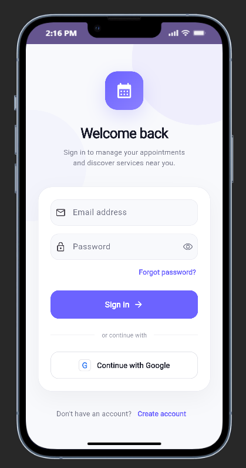
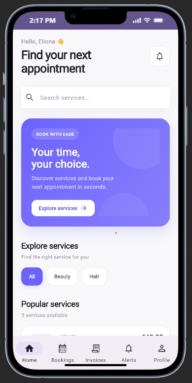
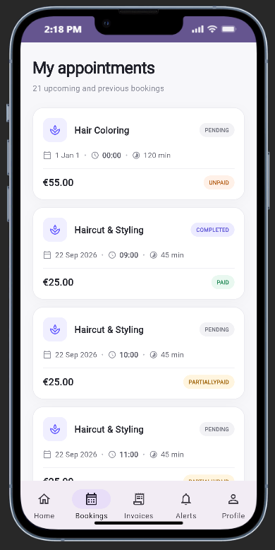
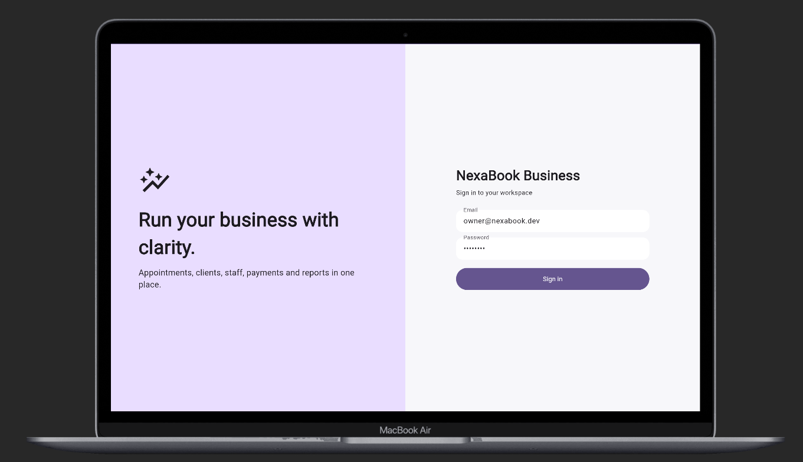
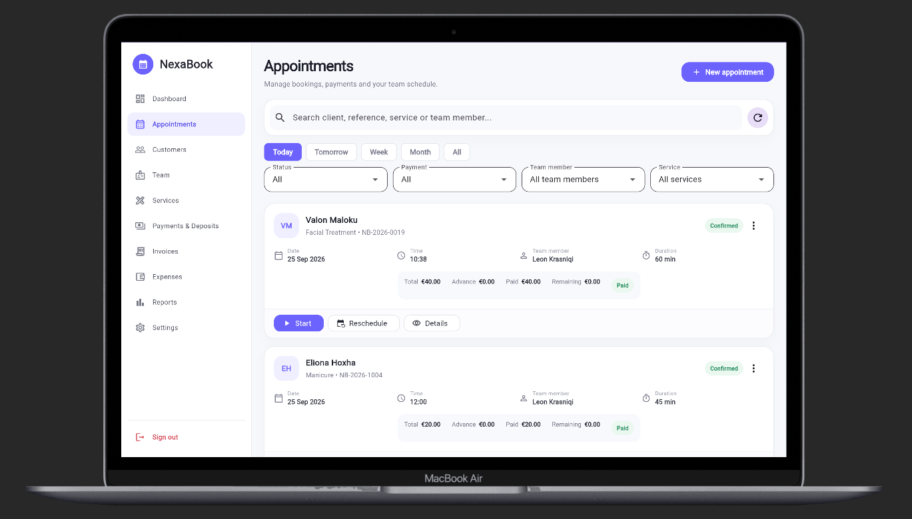
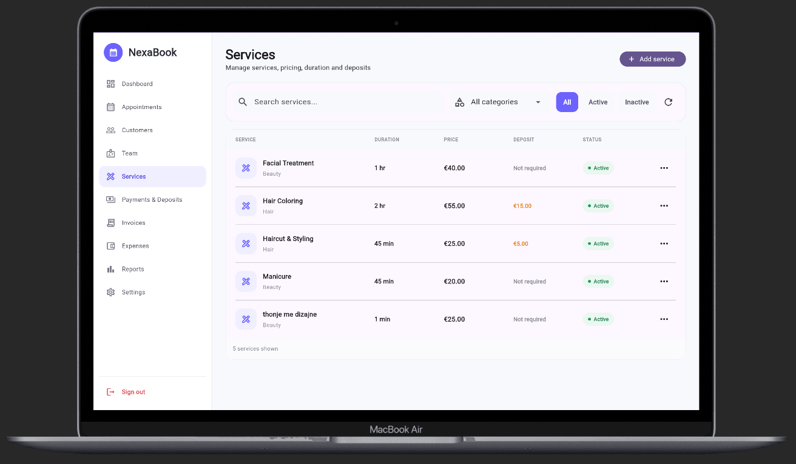
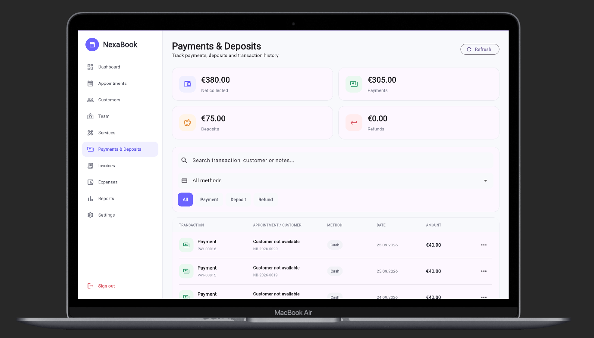
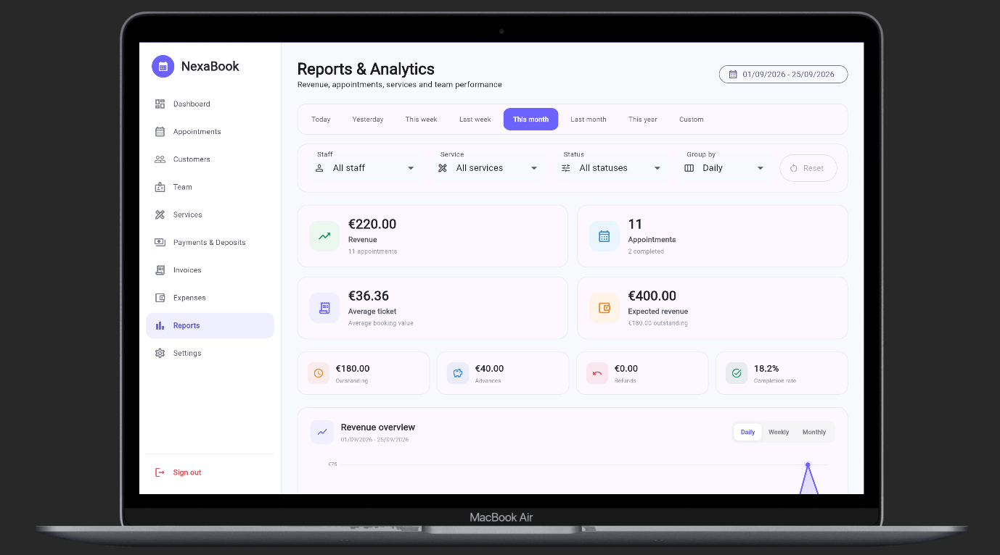

# NexaBook

NexaBook is a full-stack appointment booking and business management system built with **Flutter, ASP.NET Core and SQL Server**.

The project includes two applications connected to the same backend:

- **Client App** – browse services, book appointments, view bookings and invoices, and manage the account.
- **Business App** – manage appointments, customers, staff, services, payments, invoices, expenses and reports.

## Screenshots

### Client App

<p align="center">
  
  
  
</p>

### Business App

<p align="center">
  
  
</p>

<p align="center">
  
  
</p>

<p align="center">
  
</p>

## Tech Stack

**Frontend**
- Flutter & Dart
- Provider
- Dio

**Backend**
- ASP.NET Core Web API
- C#
- Entity Framework Core
- JWT Authentication

**Database**
- Microsoft SQL Server

## Main Features

- User authentication and role-based authorization
- Appointment booking and management
- Customer and staff management
- Services and availability
- Payments and deposits
- Invoices and expenses
- Notifications
- Reports and business dashboard
- Client profile management

## Project Structure

```text
NexaBook/
├── apps/
│   ├── nexabook_client/
│   └── nexabook_business/
├── backend/
│   └── NexaBook.Api/
├── docs/
├── screenshots/
└── README.md
```

## Running Locally

Backend:

```bash
cd backend/NexaBook.Api
dotnet restore
dotnet ef database update
dotnet run
```

Client app:

```bash
cd apps/nexabook_client
flutter pub get
flutter run
```

Business app:

```bash
cd apps/nexabook_business
flutter pub get
flutter run
```

## About

NexaBook was built as a full-stack portfolio project to work on a complete booking flow, from the client-facing application to business management, API development and database integration.
